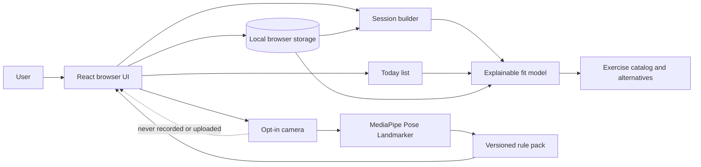
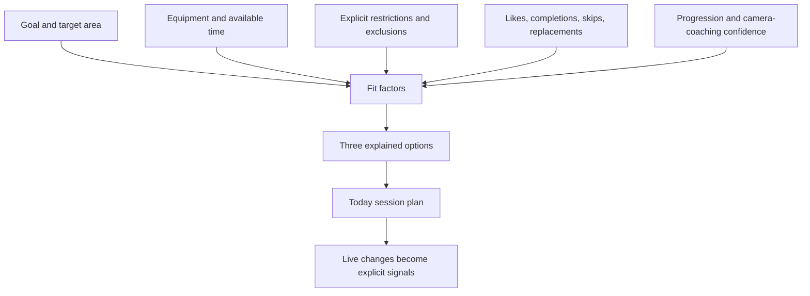

# Architecture

The browser owns all user-entered preferences, session history, and camera processing by default. Camera frames stay on-device; the coaching engine produces only short, confidence-aware cues.

## Recommendation path

Fit is a personal, transparent decision aid—not a medical assessment or universal exercise ranking.
