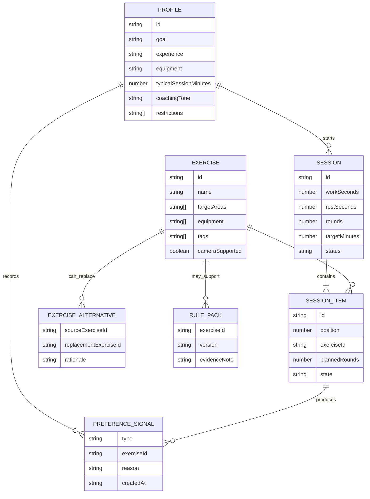

# Local Data Model

```mermaid
erDiagram
  PROFILE ||--o{ PREFERENCE_SIGNAL : records
  PROFILE ||--o{ SESSION : starts
  SESSION ||--|{ SESSION_ITEM : contains
  EXERCISE ||--o{ SESSION_ITEM : scheduled_as
  EXERCISE ||--o{ EXERCISE_ALTERNATIVE : can_replace
  EXERCISE ||--o{ RULE_PACK : may_support
  SESSION_ITEM ||--o{ PREFERENCE_SIGNAL : produces

  PROFILE {
    string id
    string goal
    string experience
    string equipment
    number typicalSessionMinutes
    string coachingTone
    string[] restrictions
  }
  EXERCISE {
    string id
    string name
    string[] targetAreas
    string[] equipment
    string[] tags
    boolean cameraSupported
  }
  SESSION {
    string id
    number workSeconds
    number restSeconds
    number rounds
    number targetMinutes
    string status
  }
  SESSION_ITEM {
    string id
    number position
    string exerciseId
    number plannedRounds
    string state
  }
  PREFERENCE_SIGNAL {
    string type
    string exerciseId
    string reason
    string createdAt
  }
  EXERCISE_ALTERNATIVE {
    string sourceExerciseId
    string replacementExerciseId
    string rationale
  }
  RULE_PACK {
    string exerciseId
    string version
    string evidenceNote
  }
```

Only user-chosen profile fields and explicit session signals are retained locally by default. Camera footage and raw pose frames are not session data.
