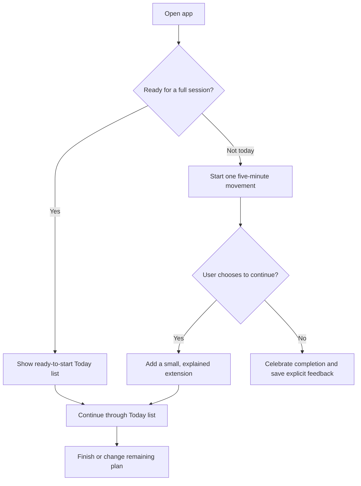
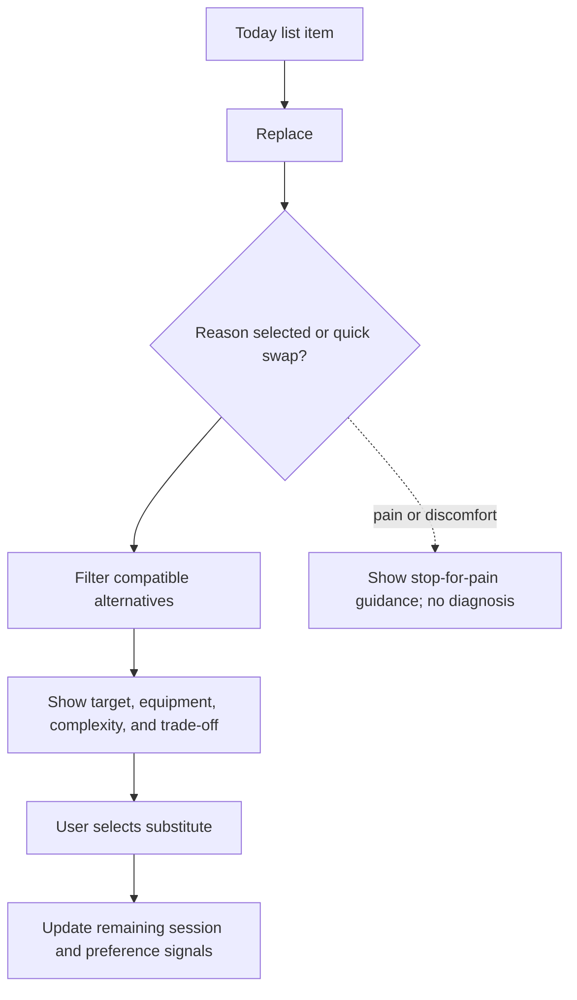

# Session and Persona Flows

## Start small and build momentum

## Replace an exercise

## Persona journeys

| Persona | Lowest-friction entry | Helpful guidance | Control retained |
| --- | --- | --- | --- |
| Maya, consistency seeker | Five-minute start | Gentle invitation to extend | Stop counts as success; reminders optional |
| Jordan, gym learner | Explained Today list | Set-up, alternatives, camera calibration | Camera is opt-in and confidence-gated |
| Alex, time-constrained | Saved defaults | Compact session and progression note | One-tap start with live pacing changes |
